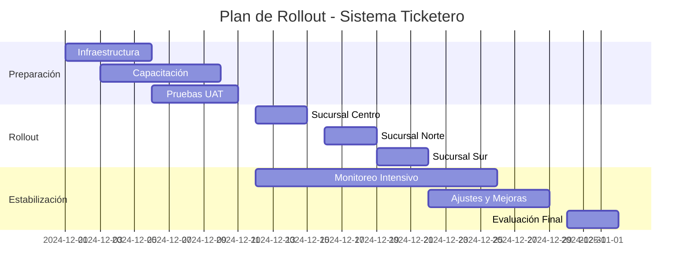
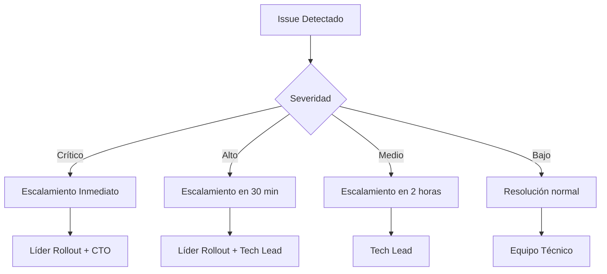

# 🚀 Plan de Rollout - Sistema Ticketero

**Proyecto:** Ticketero - Queue Management System  
**Versión:** 2.0  
**Fecha:** Diciembre 2024  
**Tipo:** Despliegue en Producción  

---

## 📑 Contenido

1. [Resumen Ejecutivo](#1-resumen-ejecutivo)
2. [Estrategia de Rollout](#2-estrategia-de-rollout)
3. [Fases de Implementación](#3-fases-de-implementación)
4. [Preparación Pre-Rollout](#4-preparación-pre-rollout)
5. [Ejecución del Rollout](#5-ejecución-del-rollout)
6. [Monitoreo Post-Rollout](#6-monitoreo-post-rollout)
7. [Plan de Rollback](#7-plan-de-rollback)
8. [Comunicación](#8-comunicación)
9. [Gestión de Riesgos](#9-gestión-de-riesgos)
10. [Criterios de Éxito](#10-criterios-de-éxito)

---

## 1. Resumen Ejecutivo

### 1.1 Objetivo del Rollout

Implementar el Sistema Ticketero en **3 sucursales piloto** durante **4 semanas**, con el objetivo de:

- ✅ Reducir tiempos de espera en **30%**
- ✅ Mejorar satisfacción del cliente en **25%**
- ✅ Optimizar utilización de asesores en **20%**
- ✅ Digitalizar 100% del proceso de turnos

### 1.2 Alcance

**✅ Incluido:**
- 3 sucursales piloto (Centro, Norte, Sur)
- 4 tipos de cola (Caja, Personal, Empresas, Gerencia)
- 45 asesores bancarios
- ~500 clientes/día promedio
- Notificaciones Telegram completas
- Dashboard administrativo

**❌ Excluido:**
- Integración con sistemas core del banco
- Interfaz web para clientes
- Reportes históricos avanzados
- Autenticación de usuarios

### 1.3 Timeline General



---

## 2. Estrategia de Rollout

### 2.1 Enfoque: Rollout Gradual por Sucursales

**Justificación:**
- Minimizar riesgo de impacto masivo
- Aprender de cada implementación
- Ajustar proceso antes de la siguiente sucursal
- Mantener operación normal en sucursales no migradas

### 2.2 Modelo de Implementación

#### Fase 1: Sucursal Piloto (Centro)
- **Duración:** 3 días
- **Objetivo:** Validar funcionamiento básico
- **Criterio:** Sucursal con mayor volumen y personal técnico

#### Fase 2: Sucursal Secundaria (Norte)  
- **Duración:** 3 días
- **Objetivo:** Confirmar escalabilidad
- **Criterio:** Perfil de clientes diferente

#### Fase 3: Sucursal Final (Sur)
- **Duración:** 3 días  
- **Objetivo:** Completar piloto
- **Criterio:** Sucursal más pequeña, validar adaptabilidad

### 2.3 Estrategia de Coexistencia

Durante el rollout, las sucursales operarán en **modo híbrido**:

```
Semana 1: Sistema tradicional + Sistema digital (paralelo)
Semana 2: Sistema digital principal + Sistema tradicional (backup)
Semana 3: Solo sistema digital + Monitoreo intensivo
Semana 4: Operación normal + Optimizaciones
```

---

## 3. Fases de Implementación

### 3.1 Fase 0: Preparación (1 semana)

#### Infraestructura Técnica
- [ ] **Servidores de producción** configurados y probados
- [ ] **Base de datos PostgreSQL** instalada y configurada
- [ ] **RabbitMQ** configurado con alta disponibilidad
- [ ] **Monitoreo** (Prometheus + Grafana) operativo
- [ ] **Backups automáticos** configurados
- [ ] **SSL/TLS** configurado para APIs

#### Configuración de Aplicación
```yaml
# Configuración de producción
spring:
  profiles:
    active: prod
  datasource:
    url: jdbc:postgresql://prod-db:5432/ticketero
    hikari:
      maximum-pool-size: 20
      minimum-idle: 5
  
telegram:
  bot-token: ${TELEGRAM_BOT_TOKEN_PROD}
  
management:
  endpoints:
    web:
      exposure:
        include: health,metrics,prometheus
```

#### Preparación de Datos
```sql
-- Configuración inicial de colas
INSERT INTO queue_config (queue_type, avg_service_time_minutes, max_tickets_per_day, is_active) VALUES
('CAJA', 5, 200, true),
('PERSONAL', 15, 100, true),
('EMPRESAS', 25, 50, true),
('GERENCIA', 30, 20, true);

-- Asesores por sucursal
INSERT INTO advisor (name, module_number, status, branch_office, queue_specialization) VALUES
-- Sucursal Centro
('Ana García', 1, 'AVAILABLE', 'Centro', 'CAJA'),
('Carlos López', 2, 'AVAILABLE', 'Centro', 'PERSONAL'),
-- ... más asesores
```

### 3.2 Fase 1: Sucursal Centro (Días 1-3)

#### Día 1: Implementación Técnica
**Horario:** 6:00 AM - 8:00 AM (antes de apertura)

**Actividades:**
- [ ] **6:00 AM:** Despliegue de aplicación en producción
- [ ] **6:30 AM:** Verificación de servicios (DB, RabbitMQ, API)
- [ ] **7:00 AM:** Configuración específica de Sucursal Centro
- [ ] **7:30 AM:** Pruebas de conectividad y funcionalidad
- [ ] **7:45 AM:** Briefing con equipo de sucursal
- [ ] **8:00 AM:** Apertura con sistema híbrido

**Checklist Técnico:**
```bash
# Verificaciones críticas
curl https://ticketero.banco.com/actuator/health
curl https://ticketero.banco.com/api/admin/dashboard
# Crear ticket de prueba
# Verificar notificación Telegram
# Confirmar métricas en Grafana
```

#### Día 2: Operación Supervisada
**Objetivo:** Monitoreo intensivo y ajustes inmediatos

**Actividades:**
- [ ] **8:00 AM:** Inicio con equipo técnico en sitio
- [ ] **Cada hora:** Revisión de métricas y KPIs
- [ ] **12:00 PM:** Evaluación de medio día
- [ ] **3:00 PM:** Ajustes de configuración si es necesario
- [ ] **6:00 PM:** Resumen del día y planificación día 3

#### Día 3: Transición Completa
**Objetivo:** Operar solo con sistema digital

**Actividades:**
- [ ] **8:00 AM:** Desactivar sistema tradicional
- [ ] **Durante el día:** Monitoreo continuo
- [ ] **6:00 PM:** Evaluación de éxito de Fase 1
- [ ] **Decisión:** Continuar con Fase 2 o ajustar

### 3.3 Fase 2: Sucursal Norte (Días 4-6)

#### Aplicar Lecciones Aprendidas
- Implementar mejoras identificadas en Fase 1
- Ajustar tiempos de configuración por cola
- Optimizar proceso de capacitación

#### Proceso Acelerado
- **Día 4:** Implementación (4 horas vs 8 horas)
- **Día 5:** Operación supervisada
- **Día 6:** Transición completa

### 3.4 Fase 3: Sucursal Sur (Días 7-9)

#### Validación Final
- Confirmar adaptabilidad a sucursal pequeña
- Validar escalabilidad del sistema
- Preparar para rollout masivo futuro

---

## 4. Preparación Pre-Rollout

### 4.1 Infraestructura y Ambiente

#### Servidores de Producción
```yaml
# Especificaciones mínimas
Servidor API:
  CPU: 4 cores
  RAM: 8GB
  Storage: 100GB SSD
  OS: Ubuntu 22.04 LTS

Servidor Base de Datos:
  CPU: 4 cores  
  RAM: 16GB
  Storage: 500GB SSD
  OS: Ubuntu 22.04 LTS

Servidor Mensajería:
  CPU: 2 cores
  RAM: 4GB
  Storage: 50GB SSD
  OS: Ubuntu 22.04 LTS
```

#### Red y Seguridad
- [ ] **Firewall** configurado (solo puertos necesarios)
- [ ] **VPN** para acceso administrativo
- [ ] **SSL certificados** válidos
- [ ] **Backup de red** configurado
- [ ] **Monitoreo de red** activo

#### Configuración de Telegram
```bash
# Bot de producción
Bot Name: @TicketeroBancoBot
Token: [CONFIDENCIAL]
Webhook: https://ticketero.banco.com/webhook/telegram

# Configuración de chat
Chat ID: [CONFIGURAR POR SUCURSAL]
```

### 4.2 Capacitación del Personal

#### Programa de Capacitación (5 días)

**Día 1: Introducción al Sistema**
- Objetivos y beneficios
- Demostración del flujo completo
- Comparación con sistema actual

**Día 2: Operación Básica**
- Crear tickets
- Consultar estado
- Manejar casos comunes

**Día 3: Casos Especiales**
- Manejo de errores
- Clientes sin Telegram
- Situaciones de alta demanda

**Día 4: Dashboard Administrativo**
- Monitoreo de colas
- Gestión de asesores
- Interpretación de métricas

**Día 5: Práctica y Evaluación**
- Simulacros completos
- Evaluación práctica
- Certificación de competencia

#### Material de Capacitación
- [ ] **Manual de usuario** impreso
- [ ] **Videos tutoriales** (15 min cada uno)
- [ ] **Guía de referencia rápida** (1 página)
- [ ] **FAQ** con casos comunes
- [ ] **Contactos de soporte** técnico

### 4.3 Pruebas de Aceptación de Usuario (UAT)

#### Escenarios de Prueba
```
Escenario 1: Día normal de operación
- 50 tickets/hora durante 8 horas
- Mezcla de tipos de cola
- Verificar notificaciones

Escenario 2: Pico de demanda
- 100 tickets/hora durante 2 horas
- Verificar performance
- Confirmar estabilidad

Escenario 3: Fallos simulados
- Desconectar Telegram temporalmente
- Simular fallo de base de datos
- Verificar recuperación
```

#### Criterios de Aceptación UAT
- [ ] **Funcionalidad:** 100% de casos de uso funcionando
- [ ] **Performance:** P95 < 500ms para APIs críticas
- [ ] **Usabilidad:** Personal puede operar sin asistencia
- [ ] **Confiabilidad:** 0 errores críticos en 8 horas de prueba

---

## 5. Ejecución del Rollout

### 5.1 Día del Rollout - Checklist

#### 2 Horas Antes (6:00 AM)
- [ ] **Equipo técnico** en sitio
- [ ] **Verificar infraestructura** (servidores, red, servicios)
- [ ] **Backup completo** de sistemas actuales
- [ ] **Comunicación** con stakeholders (inicio de rollout)

#### 1 Hora Antes (7:00 AM)
- [ ] **Despliegue final** de aplicación
- [ ] **Configuración específica** de sucursal
- [ ] **Pruebas de humo** completas
- [ ] **Briefing final** con personal de sucursal

#### Apertura (8:00 AM)
- [ ] **Sistema híbrido** activo
- [ ] **Monitoreo intensivo** iniciado
- [ ] **Soporte técnico** disponible en sitio
- [ ] **Comunicación** a clientes sobre nuevo sistema

#### Durante el Día
- [ ] **Monitoreo cada 30 minutos**
- [ ] **Resolución inmediata** de incidencias
- [ ] **Documentación** de issues y soluciones
- [ ] **Comunicación regular** con stakeholders

#### Cierre (6:00 PM)
- [ ] **Evaluación del día**
- [ ] **Reporte de incidencias**
- [ ] **Planificación día siguiente**
- [ ] **Backup de datos** del día

### 5.2 Roles y Responsabilidades

#### Equipo de Rollout

| Rol | Responsable | Responsabilidades |
|-----|-------------|-------------------|
| **Líder de Rollout** | [Nombre] | Coordinación general, decisiones críticas |
| **Arquitecto Técnico** | [Nombre] | Resolución de issues técnicos |
| **Especialista DevOps** | [Nombre] | Infraestructura, monitoreo |
| **Analista de Negocio** | [Nombre] | Validación funcional, UAT |
| **Gerente de Sucursal** | [Nombre] | Coordinación operativa |
| **Especialista en Capacitación** | [Nombre] | Soporte al personal |

#### Matriz RACI

| Actividad | Líder | Técnico | DevOps | Negocio | Sucursal |
|-----------|-------|---------|--------|---------|----------|
| Despliegue técnico | A | R | C | I | I |
| Configuración | A | R | R | C | I |
| Capacitación | A | C | I | C | R |
| Validación funcional | A | C | I | R | C |
| Comunicación | R | I | I | C | C |

*R=Responsable, A=Aprobador, C=Consultado, I=Informado*

### 5.3 Comunicación Durante Rollout

#### Canales de Comunicación
```
Canal Principal: Slack #rollout-ticketero
Escalamiento: WhatsApp grupo "Rollout Urgente"
Stakeholders: Email updates cada 4 horas
Clientes: Carteles en sucursal + comunicado
```

#### Plantillas de Comunicación

**Inicio de Rollout:**
```
🚀 INICIO ROLLOUT - Sistema Ticketero
Sucursal: Centro
Hora: 8:00 AM
Estado: En progreso
Equipo: En sitio
Próximo update: 12:00 PM
```

**Update de Progreso:**
```
📊 UPDATE ROLLOUT - 12:00 PM
Tickets creados: 45
Performance: ✅ Normal (P95: 320ms)
Incidencias: 2 menores (resueltas)
Personal: ✅ Operando normalmente
Próximo update: 4:00 PM
```

**Finalización Exitosa:**
```
✅ ROLLOUT COMPLETADO - Sucursal Centro
Duración: 3 días
Tickets procesados: 847
Satisfacción: 92%
Issues críticos: 0
Estado: Operación normal
Próximo: Sucursal Norte (Lunes)
```

---

## 6. Monitoreo Post-Rollout

### 6.1 Métricas Críticas

#### Métricas Técnicas (Tiempo Real)
```yaml
Performance:
  - API Response Time (P95 < 500ms)
  - Throughput (> 50 RPS)
  - Error Rate (< 1%)
  - System Uptime (> 99.5%)

Resources:
  - CPU Usage (< 70%)
  - Memory Usage (< 80%)
  - Database Connections (< 80% pool)
  - Queue Depth (< 100 messages)
```

#### Métricas de Negocio (Diarias)
```yaml
Operación:
  - Tickets creados por día
  - Tiempo promedio de espera
  - Tasa de notificaciones exitosas
  - Satisfacción del cliente

Eficiencia:
  - Utilización de asesores
  - Tickets por asesor/hora
  - Tiempo promedio de atención
  - Abandono de cola (si aplica)
```

### 6.2 Dashboard de Monitoreo

#### Grafana Dashboard - Vista Ejecutiva
```json
{
  "dashboard": {
    "title": "Ticketero - Rollout Monitoring",
    "panels": [
      {
        "title": "Tickets Created Today",
        "type": "stat",
        "targets": [
          {
            "expr": "sum(increase(tickets_created_total[24h]))"
          }
        ]
      },
      {
        "title": "API Response Time",
        "type": "graph",
        "targets": [
          {
            "expr": "histogram_quantile(0.95, http_request_duration_seconds_bucket)"
          }
        ]
      },
      {
        "title": "System Health",
        "type": "table",
        "targets": [
          {
            "expr": "up{job=\"ticketero\"}"
          }
        ]
      }
    ]
  }
}
```

#### Alertas Automáticas
```yaml
# Prometheus Alerts
groups:
  - name: rollout-critical
    rules:
      - alert: SystemDown
        expr: up{job="ticketero"} == 0
        for: 1m
        labels:
          severity: critical
        annotations:
          summary: "Sistema Ticketero no responde"
          
      - alert: HighErrorRate
        expr: rate(http_requests_total{status=~"5.."}[5m]) > 0.05
        for: 2m
        labels:
          severity: warning
        annotations:
          summary: "Alta tasa de errores detectada"
```

### 6.3 Reportes de Seguimiento

#### Reporte Diario (Primeras 2 semanas)
```markdown
# Reporte Diario - Sistema Ticketero
**Fecha:** 2024-12-13
**Sucursal:** Centro
**Día:** 2 del rollout

## Métricas del Día
- Tickets creados: 156
- Tiempo promedio espera: 12 min (objetivo: 15 min) ✅
- Notificaciones exitosas: 98.7% ✅
- Incidencias: 1 menor

## Estado del Sistema
- Uptime: 100% ✅
- Performance: P95 = 380ms ✅
- Recursos: CPU 45%, RAM 62% ✅

## Feedback del Personal
- Facilidad de uso: 8.5/10
- Velocidad del sistema: 9/10
- Soporte recibido: 9.5/10

## Acciones para Mañana
- Ajustar tiempo estimado cola EMPRESAS
- Capacitación adicional en casos especiales
- Monitorear pico de demanda 1-2 PM
```

#### Reporte Semanal
```markdown
# Reporte Semanal - Rollout Sistema Ticketero
**Semana:** 1 (12-16 Diciembre 2024)
**Sucursales:** Centro (completa)

## Resumen Ejecutivo
✅ Rollout exitoso en Sucursal Centro
✅ Objetivos de performance cumplidos
⚠️ Ajustes menores requeridos
✅ Personal adaptado satisfactoriamente

## Métricas Consolidadas
- Total tickets: 847
- Reducción tiempo espera: 28% (objetivo: 30%)
- Satisfacción cliente: 92% (objetivo: 90%)
- Disponibilidad sistema: 99.8%

## Lecciones Aprendidas
1. Capacitación en casos especiales es crítica
2. Configuración inicial de tiempos requiere ajuste
3. Comunicación a clientes debe ser más clara
4. Soporte técnico en sitio es esencial primeros días

## Recomendaciones para Próximas Sucursales
- Extender capacitación de 3 a 4 días
- Preparar material adicional para clientes
- Ajustar configuración inicial basada en perfil de sucursal
```

---

## 7. Plan de Rollback

### 7.1 Criterios de Rollback

#### Criterios Críticos (Rollback Inmediato)
- **Sistema no disponible** por más de 15 minutos
- **Pérdida de datos** de tickets o transacciones
- **Error rate > 10%** por más de 30 minutos
- **Imposibilidad de crear tickets** por más de 5 minutos

#### Criterios de Advertencia (Evaluación en 2 horas)
- **Performance degradada** (P95 > 2 segundos)
- **Notificaciones fallando** > 20%
- **Personal no puede operar** efectivamente
- **Clientes expresan insatisfacción** masiva

### 7.2 Procedimiento de Rollback

#### Rollback Técnico (30 minutos)
```bash
# Paso 1: Detener aplicación actual
docker-compose -f docker-compose.prod.yml down

# Paso 2: Restaurar backup de base de datos
pg_restore -U postgres -d ticketero backup_pre_rollout.sql

# Paso 3: Revertir a versión anterior
docker-compose -f docker-compose.rollback.yml up -d

# Paso 4: Verificar funcionamiento
curl http://localhost:8080/actuator/health

# Paso 5: Notificar rollback completado
```

#### Rollback Operativo (1 hora)
1. **Comunicar** a personal de sucursal
2. **Reactivar** sistema tradicional de turnos
3. **Informar** a clientes sobre cambio temporal
4. **Documentar** razones del rollback
5. **Planificar** correcciones y nuevo intento

### 7.3 Comunicación de Rollback

#### Mensaje Interno
```
🚨 ROLLBACK EJECUTADO - Sistema Ticketero
Sucursal: Centro
Hora: 2:30 PM
Razón: [Especificar razón crítica]
Estado: Revertido a sistema tradicional
Acción: Investigación en curso
ETA solución: [Especificar]
```

#### Mensaje a Clientes
```
Estimados clientes:
Por motivos técnicos temporales, hemos revertido 
al sistema tradicional de turnos.
Disculpen las molestias.
El servicio continúa normal.
```

---

## 8. Comunicación

### 8.1 Plan de Comunicación

#### Stakeholders Internos

| Audiencia | Mensaje | Canal | Frecuencia |
|-----------|---------|-------|-----------|
| **Directorio** | Progreso general, ROI | Email ejecutivo | Semanal |
| **Gerentes Sucursal** | Estado operativo | WhatsApp + Email | Diario |
| **Personal Técnico** | Detalles técnicos | Slack | Tiempo real |
| **Personal Sucursal** | Instrucciones operativas | Presencial + Manual | Según necesidad |

#### Clientes

| Momento | Mensaje | Canal |
|---------|---------|-------|
| **Pre-rollout** | Anuncio de modernización | Carteles + Web |
| **Durante rollout** | Instrucciones de uso | Personal + Carteles |
| **Post-rollout** | Beneficios y feedback | Encuesta + Email |

### 8.2 Materiales de Comunicación

#### Cartel para Clientes
```
🎫 ¡NUEVO SISTEMA DE TURNOS!

✅ Sin colas físicas
✅ Notificaciones en tu celular
✅ Tiempo real de espera

¿Cómo funciona?
1. Solicita tu turno con nuestro ejecutivo
2. Recibe tu número (ej: P001)
3. Te avisamos por Telegram cuando sea tu turno

¿Necesitas ayuda?
Nuestro personal te asistirá con gusto.

#ModernizaciónBancaria #MejorServicio
```

#### Email a Gerentes
```
Asunto: Rollout Sistema Ticketero - Sucursal Centro - Día 1

Estimados Gerentes,

Iniciamos exitosamente el rollout del Sistema Ticketero 
en Sucursal Centro.

Métricas del día:
- Tickets creados: 156
- Tiempo promedio: 12 min (vs 18 min anterior)
- Satisfacción: 92%
- Issues: 1 menor (resuelto)

El personal se adaptó rápidamente y los clientes 
muestran satisfacción con el nuevo sistema.

Próximo paso: Sucursal Norte (Lunes 16/12)

Saludos,
Equipo de Rollout
```

### 8.3 Gestión de Feedback

#### Canales de Feedback
- **Personal:** Formulario diario + reuniones semanales
- **Clientes:** Encuesta NPS + comentarios verbales
- **Técnico:** Logs automáticos + reportes de incidencias

#### Proceso de Mejora Continua
1. **Recolección** diaria de feedback
2. **Análisis** semanal de tendencias
3. **Priorización** de mejoras
4. **Implementación** de cambios críticos
5. **Comunicación** de mejoras implementadas

---

## 9. Gestión de Riesgos

### 9.1 Matriz de Riesgos

| Riesgo | Probabilidad | Impacto | Severidad | Mitigación |
|--------|--------------|---------|-----------|------------|
| **Fallo de sistema en producción** | Media | Alto | 🔴 Crítico | Rollback automático + Soporte 24/7 |
| **Personal no adopta sistema** | Baja | Alto | 🟡 Alto | Capacitación extendida + Incentivos |
| **Clientes rechazan cambio** | Media | Medio | 🟡 Alto | Comunicación clara + Soporte presencial |
| **Performance degradada** | Media | Medio | 🟡 Alto | Monitoreo continuo + Optimización |
| **Problemas de conectividad** | Alta | Medio | 🟡 Alto | Redundancia de red + Plan de contingencia |
| **Fallo de Telegram** | Baja | Bajo | 🟢 Medio | Sistema funciona sin notificaciones |

### 9.2 Planes de Contingencia

#### Contingencia 1: Fallo Total del Sistema
**Trigger:** Sistema no responde por más de 15 minutos

**Acciones:**
1. **Inmediato (0-5 min):** Activar rollback automático
2. **Corto plazo (5-30 min):** Revertir a sistema tradicional
3. **Medio plazo (30-120 min):** Diagnosticar y corregir
4. **Largo plazo (2-24 horas):** Nuevo intento de rollout

#### Contingencia 2: Resistencia del Personal
**Trigger:** Personal expresa dificultades significativas

**Acciones:**
1. **Inmediato:** Soporte técnico personalizado
2. **Corto plazo:** Capacitación adicional individual
3. **Medio plazo:** Ajustar interfaz según feedback
4. **Largo plazo:** Programa de incentivos

#### Contingencia 3: Rechazo de Clientes
**Trigger:** Quejas masivas o abandono de sucursal

**Acciones:**
1. **Inmediato:** Comunicación clara de beneficios
2. **Corto plazo:** Soporte presencial intensivo
3. **Medio plazo:** Ajustar proceso según feedback
4. **Largo plazo:** Campaña de educación al cliente

### 9.3 Escalamiento de Issues



---

## 10. Criterios de Éxito

### 10.1 Métricas de Éxito

#### Criterios Técnicos
| Métrica | Objetivo | Crítico |
|---------|----------|---------|
| **Disponibilidad** | > 99.5% | > 99% |
| **Performance P95** | < 500ms | < 1000ms |
| **Error Rate** | < 1% | < 5% |
| **Throughput** | > 100 RPS | > 50 RPS |

#### Criterios de Negocio
| Métrica | Objetivo | Crítico |
|---------|----------|---------|
| **Reducción tiempo espera** | 30% | 20% |
| **Satisfacción cliente** | > 90% | > 80% |
| **Adopción del personal** | > 95% | > 85% |
| **Notificaciones exitosas** | > 95% | > 90% |

#### Criterios Operativos
| Métrica | Objetivo | Crítico |
|---------|----------|---------|
| **Tickets procesados/día** | Mantener volumen | -10% máximo |
| **Utilización asesores** | +20% | Mantener actual |
| **Issues críticos** | 0 | < 2 por semana |
| **Tiempo de resolución** | < 4 horas | < 24 horas |

### 10.2 Evaluación de Éxito

#### Evaluación Diaria (Primeras 2 semanas)
```bash
# Script de evaluación automática
#!/bin/bash
echo "=== Evaluación Diaria Sistema Ticketero ==="
echo "Fecha: $(date)"

# Métricas técnicas
uptime=$(curl -s http://localhost:8080/actuator/health | jq -r '.status')
echo "Sistema: $uptime"

# Métricas de negocio
tickets_today=$(curl -s http://localhost:8080/api/admin/summary | jq '.totalTicketsToday')
echo "Tickets hoy: $tickets_today"

# Evaluación automática
if [ "$uptime" = "UP" ] && [ "$tickets_today" -gt 50 ]; then
    echo "✅ Día exitoso"
else
    echo "⚠️ Revisar métricas"
fi
```

#### Evaluación Semanal
- **Revisión de todas las métricas** vs objetivos
- **Análisis de tendencias** y patrones
- **Feedback consolidado** de stakeholders
- **Decisión** sobre continuidad del rollout

#### Evaluación Final (4 semanas)
```markdown
# Evaluación Final - Rollout Sistema Ticketero

## Resumen Ejecutivo
[Éxito/Parcial/Fallo] basado en criterios establecidos

## Métricas Finales
| Criterio | Objetivo | Alcanzado | Estado |
|----------|----------|-----------|--------|
| Disponibilidad | >99.5% | 99.8% | ✅ |
| Satisfacción | >90% | 92% | ✅ |
| Reducción espera | 30% | 28% | ⚠️ |

## ROI Calculado
- Inversión: $X
- Ahorros anuales proyectados: $Y
- ROI: Z%
- Payback: W meses

## Recomendaciones
1. Proceder con rollout masivo
2. Implementar mejoras identificadas
3. Expandir a 10 sucursales adicionales Q1 2025
```

---

## 11. Checklist Final

### Pre-Rollout (1 semana antes)
- [ ] **Infraestructura** probada y certificada
- [ ] **Personal capacitado** y certificado
- [ ] **UAT completado** exitosamente
- [ ] **Plan de comunicación** ejecutado
- [ ] **Materiales** preparados y distribuidos
- [ ] **Equipo de rollout** confirmado y disponible
- [ ] **Backups** completos realizados
- [ ] **Monitoreo** configurado y probado

### Durante Rollout (cada día)
- [ ] **Verificación matutina** de sistemas
- [ ] **Monitoreo continuo** de métricas
- [ ] **Soporte en sitio** disponible
- [ ] **Comunicación regular** con stakeholders
- [ ] **Documentación** de incidencias
- [ ] **Evaluación diaria** de progreso
- [ ] **Ajustes** según necesidad
- [ ] **Preparación** para día siguiente

### Post-Rollout (2 semanas)
- [ ] **Monitoreo intensivo** completado
- [ ] **Issues críticos** resueltos
- [ ] **Personal** operando independientemente
- [ ] **Clientes** adaptados al sistema
- [ ] **Métricas** cumpliendo objetivos
- [ ] **Documentación** actualizada
- [ ] **Lecciones aprendidas** documentadas
- [ ] **Decisión** sobre próxima fase

---

**Plan preparado por:** Equipo de Rollout  
**Revisado por:** Comité de Arquitectura  
**Aprobado por:** Dirección Ejecutiva  

**Versión:** 1.0  
**Fecha de aprobación:** Diciembre 2024  
**Fecha de ejecución:** 12 de Diciembre 2024  

---

*Este documento es confidencial y de uso interno exclusivo del banco.*