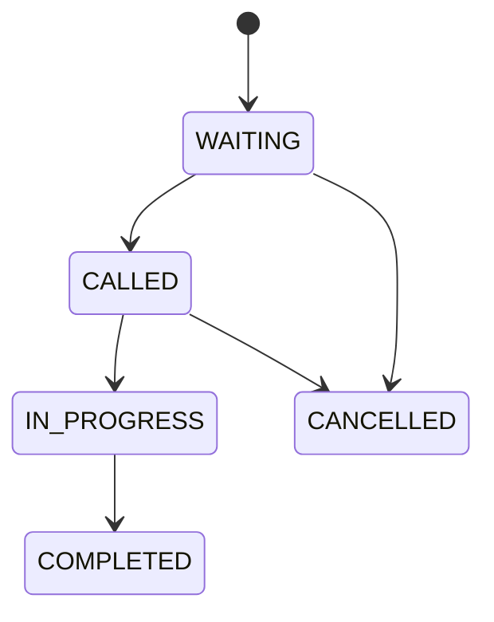

# 📐 Reglas de Negocio - Sistema Ticketero

**Proyecto:** Ticketero - Queue Management System  
**Versión:** 2.0  
**Fecha:** Diciembre 2024  
**Estado:** Implementado  

---

## 📑 Contenido

1. [Reglas de Validación](#1-reglas-de-validación)
2. [Reglas de Generación de Tickets](#2-reglas-de-generación-de-tickets)
3. [Reglas de Cola y Posicionamiento](#3-reglas-de-cola-y-posicionamiento)
4. [Reglas de Notificaciones](#4-reglas-de-notificaciones)
5. [Reglas de Asesores](#5-reglas-de-asesores)
6. [Reglas de Estados](#6-reglas-de-estados)
7. [Reglas de Tiempo](#7-reglas-de-tiempo)
8. [Reglas de Consistencia](#8-reglas-de-consistencia)

---

## 1. Reglas de Validación

### RN-001: Validación de ID Nacional
**Regla:** El ID nacional debe tener entre 8 y 12 dígitos numéricos  
**Implementación:** `@Pattern(regexp = "^[0-9]{8,12}$")`  
**Justificación:** Compatibilidad con diferentes formatos de identificación por país  

```java
// Ejemplos válidos:
"12345678"     // 8 dígitos
"123456789012" // 12 dígitos

// Ejemplos inválidos:
"1234567"      // Muy corto
"12345678901234" // Muy largo
"12345678A"    // Contiene letras
```

### RN-002: Validación de Teléfono
**Regla:** El teléfono es opcional, pero si se proporciona debe tener entre 9 y 15 dígitos  
**Implementación:** `@Pattern(regexp = "^[0-9]{9,15}$")`  
**Justificación:** Formato internacional de teléfonos  

```java
// Ejemplos válidos:
"987654321"    // 9 dígitos
"51987654321"  // Con código de país
null           // Opcional

// Ejemplos inválidos:
"12345678"     // Muy corto
"1234567890123456" // Muy largo
"+51987654321" // Con símbolos
```

### RN-003: Normalización de Datos
**Regla:** Los campos en blanco se convierten a null  
**Implementación:** Constructor compacto en TicketCreateRequest  

```java
public TicketCreateRequest {
    if (telefono != null && telefono.isBlank()) {
        telefono = null;
    }
}
```

---

## 2. Reglas de Generación de Tickets

### RN-004: Formato de Número de Ticket
**Regla:** Cada tipo de cola tiene un prefijo específico seguido de 3 dígitos  
**Implementación:** Método `generarNumeroTicket()`  

| Tipo de Cola | Prefijo | Formato | Ejemplo |
|--------------|---------|---------|---------|
| CAJA | C | C### | C001, C002, C999 |
| PERSONAL | P | P### | P001, P002, P999 |
| EMPRESAS | E | E### | E001, E002, E999 |
| GERENCIA | G | G### | G001, G002, G999 |

```java
private String generarNumeroTicket(QueueType queueType) {
    char prefijo = queueType.name().charAt(0);
    int numero = (int) (Math.random() * 999) + 1;
    return String.format("%c%03d", prefijo, numero);
}
```

### RN-005: Unicidad de Código de Referencia
**Regla:** Cada ticket tiene un UUID único como código de referencia  
**Implementación:** `UUID.randomUUID()` en creación  
**Justificación:** Permite tracking sin exponer IDs secuenciales  

### RN-006: Asignación Automática de Timestamps
**Regla:** El sistema asigna automáticamente la fecha de creación  
**Implementación:** `@PrePersist` en entidad Ticket  

```java
@PrePersist
protected void onCreate() {
    this.createdAt = LocalDateTime.now();
    if (this.codigoReferencia == null) {
        this.codigoReferencia = UUID.randomUUID();
    }
}
```

---

## 3. Reglas de Cola y Posicionamiento

### RN-007: Cálculo de Posición en Cola
**Regla:** La posición se calcula contando tickets activos en la misma cola  
**Implementación:** `QueueManagementService.calcularPosicionEnCola()`  
**Estados considerados:** Solo tickets con estado `WAITING`  

```java
public int calcularPosicionEnCola(QueueType queueType) {
    List<Ticket> ticketsActivos = ticketRepository.findByQueueAndStatus(
        queueType, TicketStatus.WAITING
    );
    return ticketsActivos.size() + 1; // Nueva posición
}
```

### RN-008: Tiempo Estimado de Espera
**Regla:** Tiempo = Posición × Tiempo Promedio de Atención por Cola  
**Implementación:** `QueueManagementService.calcularTiempoEstimado()`  

| Cola | Tiempo Promedio | Cálculo |
|------|----------------|---------|
| CAJA | 5 minutos | Posición × 5 min |
| PERSONAL | 15 minutos | Posición × 15 min |
| EMPRESAS | 25 minutos | Posición × 25 min |
| GERENCIA | 30 minutos | Posición × 30 min |

### RN-009: Actualización de Posiciones
**Regla:** Las posiciones se recalculan en tiempo real al consultar  
**Implementación:** Método `obtenerPosicionEnCola()`  
**Justificación:** Reflejar cambios por tickets completados o cancelados  

---

## 4. Reglas de Notificaciones

### RN-010: Condición para Notificaciones
**Regla:** Solo se envían notificaciones si el teléfono está presente  
**Implementación:** Validación en `NotificationService`  

```java
if (ticket.getTelefono() != null && !ticket.getTelefono().isBlank()) {
    // Enviar notificación
}
```

### RN-011: Tipos de Notificación
**Regla:** Existen exactamente 3 tipos de notificación por ticket  

1. **CONFIRMACION:** Inmediata al crear ticket
2. **PROXIMIDAD:** Cuando quedan 3 turnos
3. **TURNO_ACTIVO:** Cuando es el turno del cliente

### RN-012: Notificación de Proximidad Única
**Regla:** La notificación de proximidad se envía solo una vez  
**Implementación:** Campo `proximoTurnoNotificado` en entidad Ticket  

```java
@Column(name = "proximo_turno_notificado")
@Builder.Default
private Boolean proximoTurnoNotificado = false;
```

### RN-013: Contenido de Notificaciones
**Regla:** Cada notificación incluye información específica  

**Confirmación:**
- Número de ticket
- Posición en cola
- Tiempo estimado
- Sucursal

**Proximidad:**
- Número de ticket
- "Faltan 3 turnos"
- Tiempo actualizado

**Turno Activo:**
- Número de ticket
- Número de módulo
- Nombre del asesor

---

## 5. Reglas de Asesores

### RN-014: Estados de Asesor
**Regla:** Un asesor puede estar en uno de 4 estados  

```java
public enum AdvisorStatus {
    AVAILABLE,  // Disponible para atender
    BUSY,       // Atendiendo cliente
    BREAK,      // En descanso
    OFFLINE     // Fuera de servicio
}
```

### RN-015: Asignación de Tickets
**Regla:** Los tickets se asignan automáticamente a asesores disponibles  
**Criterios de asignación:**
1. Estado `AVAILABLE`
2. Especialización en el tipo de cola
3. Menor carga de trabajo actual
4. Módulo físico asignado

### RN-016: Especialización por Cola
**Regla:** Cada asesor puede especializarse en tipos específicos de cola  
**Implementación:** Relación many-to-many entre Advisor y QueueType  

---

## 6. Reglas de Estados

### RN-017: Ciclo de Vida del Ticket
**Regla:** Los tickets siguen un flujo de estados específico  



### RN-018: Transiciones de Estado Válidas
**Regla:** Solo ciertas transiciones de estado son permitidas  

| Estado Actual | Estados Permitidos |
|---------------|-------------------|
| WAITING | CALLED, CANCELLED |
| CALLED | IN_PROGRESS, CANCELLED |
| IN_PROGRESS | COMPLETED |
| COMPLETED | (Final) |
| CANCELLED | (Final) |

### RN-019: Estado Inicial por Defecto
**Regla:** Todo ticket nuevo inicia en estado `WAITING`  
**Implementación:** `@PrePersist` en entidad Ticket  

```java
@PrePersist
protected void onCreate() {
    if (this.status == null) {
        this.status = TicketStatus.WAITING;
    }
}
```

---

## 7. Reglas de Tiempo

### RN-020: Timestamps Automáticos
**Regla:** El sistema registra automáticamente eventos temporales  

| Campo | Cuándo se asigna |
|-------|------------------|
| `createdAt` | Al crear ticket |
| `calledAt` | Al cambiar a CALLED |
| `startedAt` | Al cambiar a IN_PROGRESS |
| `completedAt` | Al cambiar a COMPLETED |

### RN-021: Zona Horaria
**Regla:** Todos los timestamps usan la zona horaria del servidor  
**Implementación:** `LocalDateTime.now()`  
**Consideración:** Para multi-región, usar `ZonedDateTime`  

### RN-022: Tiempo de Expiración
**Regla:** Los tickets no tienen expiración automática  
**Justificación:** Los clientes pueden llegar en cualquier momento del día  
**Alternativa:** Limpieza manual por administradores  

---

## 8. Reglas de Consistencia

### RN-023: Patrón Outbox
**Regla:** Toda operación que afecte múltiples sistemas usa el patrón Outbox  
**Implementación:** Tabla `outbox_message` para garantizar consistencia  

```java
@Transactional
public TicketResponse crearTicket(TicketCreateRequest request) {
    // 1. Guardar ticket en DB
    ticket = ticketRepository.saveAndFlush(ticket);
    
    // 2. Guardar mensaje outbox (misma transacción)
    guardarEnOutbox(ticket);
    
    // 3. El OutboxPublisherService enviará a RabbitMQ
    return response;
}
```

### RN-024: Integridad Referencial
**Regla:** Las relaciones entre entidades deben mantenerse consistentes  

**Relaciones críticas:**
- Ticket → Advisor (nullable, puede no tener asesor asignado)
- Ticket → TicketEvent (cascade, eventos se eliminan con ticket)
- OutboxMessage → Ticket (referencia por aggregateId)

### RN-025: Idempotencia
**Regla:** Las operaciones críticas deben ser idempotentes  
**Implementación:** Uso de UUIDs como identificadores únicos  
**Beneficio:** Permite reintentos seguros en caso de fallos  

### RN-026: Validación de Concurrencia
**Regla:** El sistema debe manejar acceso concurrente a las colas  
**Implementación:** Transacciones y locks optimistas  
**Consideración:** Para alta concurrencia, usar locks pesimistas  

---

## 9. Reglas de Configuración

### RN-027: Configuración por Cola
**Regla:** Cada cola tiene configuración específica almacenada en BD  

```java
@Entity
public class QueueConfig {
    private QueueType queueType;
    private Integer avgServiceTimeMinutes;
    private Integer maxTicketsPerDay;
    private Boolean isActive;
    private String operatingHours;
}
```

### RN-028: Valores por Defecto
**Regla:** El sistema tiene valores por defecto para configuraciones faltantes  

| Parámetro | Valor por Defecto |
|-----------|-------------------|
| Tiempo de atención | 15 minutos |
| Máximo tickets/día | 100 |
| Horario operación | 08:00-17:00 |
| Estado activo | true |

### RN-029: Configuración Dinámica
**Regla:** Las configuraciones pueden cambiarse sin reiniciar el sistema  
**Implementación:** Cache con TTL de 5 minutos  
**Beneficio:** Ajustes en tiempo real según demanda  

---

## 10. Reglas de Seguridad

### RN-030: Sanitización de Logs
**Regla:** Los datos sensibles deben sanitizarse en logs  
**Implementación:** Clase `LogSanitizer`  

```java
log.info("Creating ticket for user: {}", sanitize(request.nationalId()));
// Output: "Creating ticket for user: 123****78"
```

### RN-031: Validación de Entrada
**Regla:** Toda entrada de usuario debe validarse antes del procesamiento  
**Implementación:** Bean Validation con `@Valid`  
**Cobertura:** Todos los endpoints públicos  

### RN-032: Manejo de Errores
**Regla:** Los errores no deben exponer información interna del sistema  
**Implementación:** `GlobalExceptionHandler`  
**Principio:** Fallar de forma segura  

---

## 11. Reglas de Performance

### RN-033: Límites de Consulta
**Regla:** Las consultas de lista deben estar paginadas  
**Implementación:** `Pageable` en endpoints de consulta masiva  
**Límite por defecto:** 20 elementos por página  

### RN-034: Cache de Configuraciones
**Regla:** Las configuraciones de cola se cachean para evitar consultas repetitivas  
**TTL:** 5 minutos  
**Invalidación:** Manual vía endpoint administrativo  

### RN-035: Procesamiento Asíncrono
**Regla:** Las notificaciones se procesan de forma asíncrona  
**Implementación:** RabbitMQ con workers dedicados  
**Beneficio:** No bloquear la creación de tickets  

---

## 12. Reglas de Monitoreo

### RN-036: Métricas Obligatorias
**Regla:** El sistema debe exponer métricas específicas  

**Métricas de negocio:**
- Tickets creados por cola
- Tiempo promedio de espera
- Tasa de abandono (si aplica)

**Métricas técnicas:**
- Latencia de endpoints
- Errores por minuto
- Uso de recursos

### RN-037: Health Checks
**Regla:** El sistema debe exponer endpoints de salud  
**Implementación:** Spring Boot Actuator  
**Verificaciones:**
- Conectividad a PostgreSQL
- Conectividad a RabbitMQ
- Estado del bot de Telegram

---

## 13. Excepciones y Casos Especiales

### RN-038: Manejo de Fallos de Telegram
**Regla:** Los fallos de Telegram no deben afectar la creación de tickets  
**Implementación:** Try-catch con logging de errores  
**Comportamiento:** Ticket se crea, notificación se reintenta  

### RN-039: Cola Llena
**Regla:** Si una cola alcanza su límite, se debe notificar pero no rechazar  
**Implementación:** Warning en logs, métricas de alerta  
**Justificación:** Mejor experiencia de usuario  

### RN-040: Asesor No Disponible
**Regla:** Si no hay asesores disponibles, el ticket queda en espera  
**Comportamiento:** Estado `WAITING` hasta que haya disponibilidad  
**Notificación:** Se informa tiempo estimado extendido  

---

## 14. Reglas de Migración y Versionado

### RN-041: Migraciones de Base de Datos
**Regla:** Todos los cambios de esquema deben usar Flyway  
**Convención:** `V{version}__{description}.sql`  
**Principio:** Solo migraciones hacia adelante (no rollback)  

### RN-042: Compatibilidad de API
**Regla:** Los cambios de API deben mantener compatibilidad hacia atrás  
**Estrategia:** Versionado semántico  
**Deprecación:** Mínimo 2 versiones antes de eliminar  

---

## 15. Matriz de Reglas vs Implementación

| Regla | Clase/Método | Test | Estado |
|-------|--------------|------|--------|
| RN-001 | TicketCreateRequest | ✅ | Implementado |
| RN-002 | TicketCreateRequest | ✅ | Implementado |
| RN-004 | TicketService.generarNumeroTicket() | ✅ | Implementado |
| RN-007 | QueueManagementService | ✅ | Implementado |
| RN-008 | QueueManagementService | ✅ | Implementado |
| RN-010 | NotificationService | ✅ | Implementado |
| RN-012 | Ticket.proximoTurnoNotificado | ✅ | Implementado |
| RN-023 | TicketService.guardarEnOutbox() | ✅ | Implementado |
| RN-030 | LogSanitizer | ✅ | Implementado |

---

**Documento validado por:**
- Business Analyst: [Nombre]
- Tech Lead: [Nombre]
- Product Owner: [Nombre]

**Última actualización:** Diciembre 2024  
**Próxima revisión:** Enero 2025