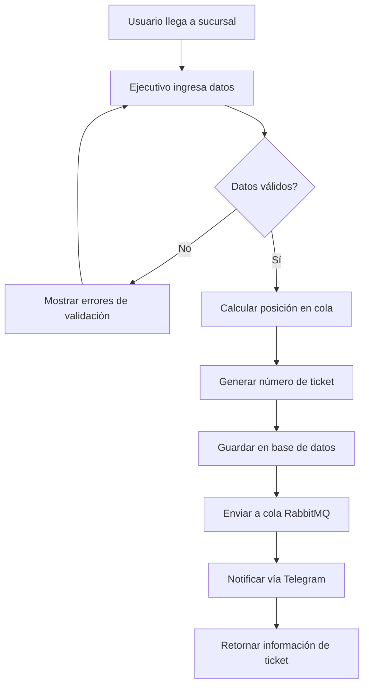
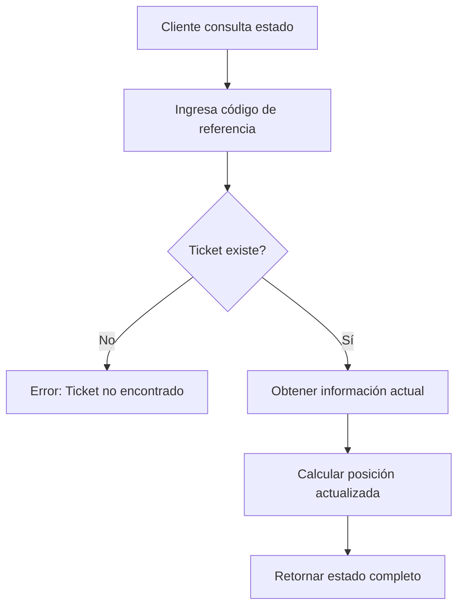
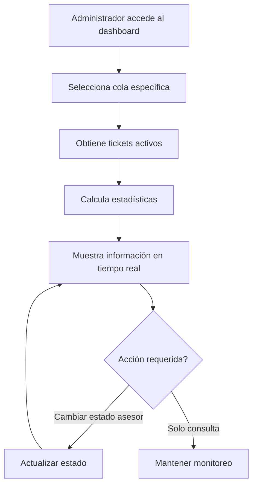
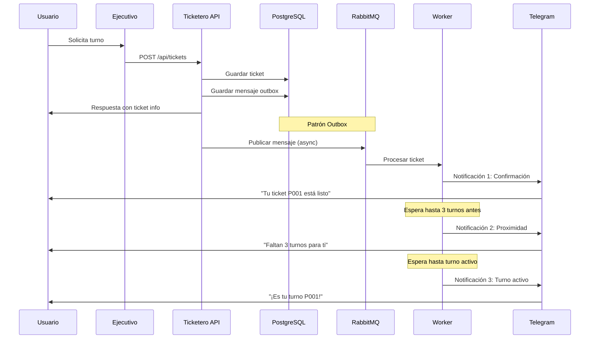
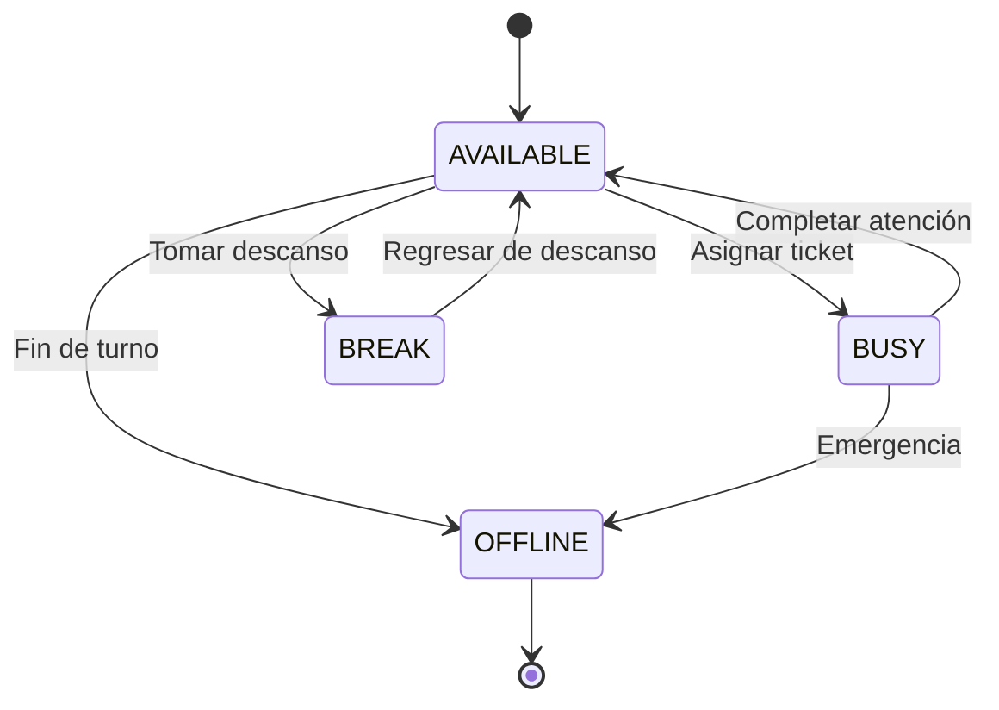

# 📋 Requerimientos Funcionales - Sistema Ticketero

**Proyecto:** Ticketero - Queue Management System  
**Versión:** 2.0  
**Fecha:** Diciembre 2024  
**Estado:** Implementado y Funcional  

---

## 📑 Contenido

1. [Visión General](#1-visión-general)
2. [Actores del Sistema](#2-actores-del-sistema)
3. [Requerimientos Funcionales](#3-requerimientos-funcionales)
4. [Casos de Uso](#4-casos-de-uso)
5. [Flujos de Proceso](#5-flujos-de-proceso)
6. [Criterios de Aceptación](#6-criterios-de-aceptación)
7. [Matriz de Trazabilidad](#7-matriz-de-trazabilidad)

---

## 1. Visión General

### 1.1 Propósito del Sistema

El Sistema Ticketero es una solución de gestión de turnos para sucursales bancarias que automatiza:
- **Emisión de tickets** con posicionamiento real en cola
- **Notificaciones automáticas** vía Telegram en 3 momentos clave
- **Gestión administrativa** con dashboard en tiempo real
- **Asignación de asesores** por tipo de servicio

### 1.2 Alcance Funcional

**✅ Funcionalidades Implementadas:**
- Creación de tickets con validaciones
- Gestión de 4 tipos de cola (Caja, Personal, Empresas, Gerencia)
- Cálculo de posición y tiempo estimado real
- Notificaciones Telegram automáticas
- Dashboard administrativo completo
- Gestión de asesores y módulos
- Métricas y monitoreo

**❌ Fuera del Alcance:**
- Interfaz web para usuarios finales
- Integración con sistemas bancarios core
- Autenticación de usuarios
- Reportes históricos avanzados

---

## 2. Actores del Sistema

### 2.1 Actores Primarios

| Actor | Descripción | Responsabilidades |
|-------|-------------|-------------------|
| **Usuario/Cliente** | Persona que solicita un turno | Proporcionar datos para crear ticket |
| **Ejecutivo de Sucursal** | Personal que opera el sistema | Crear tickets, gestionar cola |
| **Asesor Bancario** | Personal que atiende clientes | Atender turnos asignados |
| **Administrador** | Supervisor de sucursal | Monitorear sistema, gestionar asesores |

### 2.2 Actores Secundarios

| Actor | Descripción | Interacción |
|-------|-------------|-------------|
| **Sistema Telegram** | Plataforma de mensajería | Recibe y entrega notificaciones |
| **Sistema de Monitoreo** | Prometheus/Grafana | Recolecta métricas del sistema |

---

## 3. Requerimientos Funcionales

### RF-001: Gestión de Tickets

#### RF-001.1 Crear Ticket
**Descripción:** El sistema debe permitir crear un nuevo ticket de turno  
**Prioridad:** Alta  
**Estado:** ✅ Implementado  

**Criterios:**
- Validar ID nacional (8-12 dígitos)
- Validar teléfono (9-15 dígitos, opcional)
- Asignar número único por cola
- Calcular posición real en cola
- Estimar tiempo de espera
- Generar código de referencia UUID

#### RF-001.2 Consultar Ticket
**Descripción:** Permitir consultar estado de ticket por código de referencia  
**Prioridad:** Alta  
**Estado:** ✅ Implementado  

**Criterios:**
- Buscar por UUID de referencia
- Mostrar información completa del ticket
- Incluir asesor asignado (si aplica)
- Mostrar timestamps de eventos

#### RF-001.3 Consultar Posición en Cola
**Descripción:** Obtener posición actual y tiempo estimado  
**Prioridad:** Alta  
**Estado:** ✅ Implementado  

**Criterios:**
- Calcular posición actual en tiempo real
- Mostrar tickets adelante
- Actualizar tiempo estimado
- Incluir configuración de cola

### RF-002: Gestión de Colas

#### RF-002.1 Tipos de Cola
**Descripción:** Soportar múltiples tipos de servicio  
**Prioridad:** Alta  
**Estado:** ✅ Implementado  

**Tipos Implementados:**
- **CAJA:** Operaciones básicas (depósitos, retiros)
- **PERSONAL:** Banca personal (cuentas, tarjetas)
- **EMPRESAS:** Banca empresarial (créditos, servicios)
- **GERENCIA:** Atención gerencial (casos especiales)

#### RF-002.2 Configuración de Cola
**Descripción:** Cada cola tiene configuración específica  
**Prioridad:** Media  
**Estado:** ✅ Implementado  

**Parámetros:**
- Tiempo promedio de atención
- Número máximo de tickets
- Asesores asignados por defecto
- Horarios de operación

### RF-003: Sistema de Notificaciones

#### RF-003.1 Notificación de Creación
**Descripción:** Enviar confirmación inmediata al crear ticket  
**Prioridad:** Alta  
**Estado:** ✅ Implementado  

**Contenido:**
- Número de ticket
- Posición en cola
- Tiempo estimado
- Sucursal

#### RF-003.2 Notificación de Proximidad
**Descripción:** Avisar cuando faltan 3 turnos  
**Prioridad:** Alta  
**Estado:** ✅ Implementado  

**Criterios:**
- Enviar cuando quedan exactamente 3 tickets adelante
- Solo una vez por ticket
- Incluir tiempo actualizado

#### RF-003.3 Notificación de Turno Activo
**Descripción:** Avisar cuando es el turno del cliente  
**Prioridad:** Alta  
**Estado:** ✅ Implementado  

**Contenido:**
- Confirmación de turno activo
- Número de módulo asignado
- Nombre del asesor
- Instrucciones de ubicación

### RF-004: Dashboard Administrativo

#### RF-004.1 Vista General del Sistema
**Descripción:** Panel principal con estado de todas las colas  
**Prioridad:** Alta  
**Estado:** ✅ Implementado  

**Información:**
- Tickets por cola
- Estadísticas de asesores
- Timestamp de actualización
- Resumen ejecutivo

#### RF-004.2 Gestión de Colas
**Descripción:** Monitoreo detallado por cola  
**Prioridad:** Alta  
**Estado:** ✅ Implementado  

**Funcionalidades:**
- Lista de tickets activos
- Estadísticas de cola
- Tiempo promedio de atención
- Tickets en espera vs atendidos

#### RF-004.3 Gestión de Asesores
**Descripción:** Administración de personal de atención  
**Prioridad:** Media  
**Estado:** ✅ Implementado  

**Funcionalidades:**
- Lista de asesores activos
- Cambio de estado (Disponible/Ocupado/Descanso)
- Estadísticas de productividad
- Asignación a módulos

### RF-005: Gestión de Asesores

#### RF-005.1 Estados de Asesor
**Descripción:** Control de disponibilidad de asesores  
**Prioridad:** Media  
**Estado:** ✅ Implementado  

**Estados:**
- **AVAILABLE:** Disponible para atender
- **BUSY:** Atendiendo cliente
- **BREAK:** En descanso
- **OFFLINE:** Fuera de servicio

#### RF-005.2 Asignación Automática
**Descripción:** Asignar tickets a asesores disponibles  
**Prioridad:** Media  
**Estado:** ✅ Implementado  

**Criterios:**
- Priorizar asesores disponibles
- Considerar especialización por cola
- Balancear carga de trabajo
- Respetar módulos asignados

---

## 4. Casos de Uso

### CU-001: Crear Ticket de Turno



**Precondiciones:**
- Sistema operativo
- Conexión a base de datos activa
- Bot de Telegram configurado

**Flujo Principal:**
1. Ejecutivo accede al endpoint POST /api/tickets
2. Ingresa nationalId, teléfono, sucursal y tipo de cola
3. Sistema valida datos de entrada
4. Calcula posición real en cola
5. Genera número único de ticket
6. Guarda ticket en base de datos
7. Publica mensaje en RabbitMQ (patrón Outbox)
8. Envía notificación de confirmación vía Telegram
9. Retorna información completa del ticket

**Postcondiciones:**
- Ticket creado en base de datos
- Cliente notificado vía Telegram
- Métricas actualizadas

### CU-002: Consultar Estado de Ticket



**Precondiciones:**
- Ticket previamente creado
- Código de referencia válido

**Flujo Principal:**
1. Cliente o ejecutivo accede a GET /api/tickets/{uuid}
2. Sistema busca ticket por código de referencia
3. Obtiene información actualizada
4. Calcula posición actual en cola
5. Retorna estado completo del ticket

### CU-003: Gestionar Cola Administrativa



---

## 5. Flujos de Proceso

### 5.1 Flujo de Notificaciones Telegram



### 5.2 Flujo de Gestión de Asesores



---

## 6. Criterios de Aceptación

### CA-001: Creación de Tickets

**Dado** que un ejecutivo tiene datos válidos de un cliente  
**Cuando** envía una petición POST /api/tickets  
**Entonces** el sistema debe:
- ✅ Validar formato de ID nacional (8-12 dígitos)
- ✅ Validar teléfono si se proporciona (9-15 dígitos)
- ✅ Generar número único por cola (P001, C001, etc.)
- ✅ Calcular posición real en cola
- ✅ Estimar tiempo de espera basado en configuración
- ✅ Retornar código de referencia UUID
- ✅ Enviar notificación Telegram en menos de 5 segundos

### CA-002: Consulta de Posición

**Dado** que existe un ticket válido  
**Cuando** se consulta la posición por número  
**Entonces** el sistema debe:
- ✅ Mostrar posición actual en tiempo real
- ✅ Listar tickets que están adelante
- ✅ Calcular tiempo estimado actualizado
- ✅ Incluir información del asesor asignado (si aplica)

### CA-003: Dashboard Administrativo

**Dado** que un administrador accede al dashboard  
**Cuando** consulta el estado general  
**Entonces** el sistema debe:
- ✅ Mostrar tickets por cada cola
- ✅ Estadísticas de asesores en tiempo real
- ✅ Permitir cambiar estado de asesores
- ✅ Actualizar información cada 30 segundos máximo

### CA-004: Notificaciones Telegram

**Dado** que un ticket ha sido creado  
**Cuando** se procesan las notificaciones  
**Entonces** el sistema debe:
- ✅ Enviar confirmación inmediata (< 5 segundos)
- ✅ Enviar aviso de proximidad (cuando quedan 3 turnos)
- ✅ Enviar notificación de turno activo
- ✅ Incluir información relevante en cada mensaje
- ✅ Manejar errores de entrega sin afectar el ticket

---

## 7. Matriz de Trazabilidad

| Requerimiento | Endpoint | Servicio | Test | Estado |
|---------------|----------|----------|------|--------|
| RF-001.1 | POST /api/tickets | TicketService.crearTicket() | TicketServiceTest | ✅ |
| RF-001.2 | GET /api/tickets/{uuid} | TicketService.obtenerTicketPorCodigo() | TicketServiceTest | ✅ |
| RF-001.3 | GET /api/tickets/{numero}/position | TicketService.obtenerPosicionEnCola() | TicketServiceTest | ✅ |
| RF-002.1 | - | QueueType enum | - | ✅ |
| RF-002.2 | - | QueueManagementService | QueueManagementServiceTest | ✅ |
| RF-003.1 | - | NotificationService | NotificationServiceTest | ✅ |
| RF-003.2 | - | TicketWorker | - | ✅ |
| RF-003.3 | - | TicketWorker | - | ✅ |
| RF-004.1 | GET /api/admin/dashboard | AdminController | - | ✅ |
| RF-004.2 | GET /api/admin/queues/{type} | AdminController | - | ✅ |
| RF-004.3 | GET /api/admin/advisors | AdvisorService | AdvisorServiceTest | ✅ |
| RF-005.1 | PUT /api/admin/advisors/{id}/status | AdvisorService | AdvisorServiceTest | ✅ |
| RF-005.2 | - | AdvisorService | AdvisorServiceTest | ✅ |

---

## 8. Validaciones y Restricciones

### 8.1 Validaciones de Entrada

| Campo | Validación | Mensaje de Error |
|-------|------------|------------------|
| nationalId | Regex: ^[0-9]{8,12}$ | "ID nacional inválido" |
| telefono | Regex: ^[0-9]{9,15}$ (opcional) | "Teléfono inválido" |
| branchOffice | @NotBlank | "La sucursal es obligatoria" |
| queueType | @NotNull | "El tipo de cola es obligatorio" |

### 8.2 Reglas de Negocio

1. **Unicidad de Números:** Cada cola genera números únicos (P001, C001, E001, G001)
2. **Posicionamiento:** La posición se calcula en tiempo real basada en tickets activos
3. **Tiempo Estimado:** Se calcula multiplicando posición × tiempo promedio de atención
4. **Notificaciones:** Solo se envían si el teléfono está presente
5. **Estados de Ticket:** WAITING → CALLED → IN_PROGRESS → COMPLETED
6. **Asignación de Asesores:** Automática basada en disponibilidad y especialización

---

## 9. Métricas y KPIs

### 9.1 Métricas Funcionales

| Métrica | Descripción | Objetivo |
|---------|-------------|----------|
| Tickets Creados | Total de tickets por cola | Monitorear demanda |
| Tiempo Promedio de Espera | Tiempo real vs estimado | < 15% de diferencia |
| Tasa de Notificaciones Exitosas | % de mensajes Telegram entregados | > 95% |
| Tiempo de Respuesta API | Latencia de endpoints | < 500ms P95 |

### 9.2 Métricas Técnicas

| Métrica | Descripción | Objetivo |
|---------|-------------|----------|
| Disponibilidad del Sistema | Uptime del API | > 99.5% |
| Procesamiento de Cola | Mensajes RabbitMQ procesados | 0 mensajes perdidos |
| Conexiones de BD | Pool de conexiones PostgreSQL | < 80% utilización |

---

## 10. Dependencias Externas

### 10.1 Servicios Externos

| Servicio | Propósito | Criticidad | Fallback |
|----------|-----------|------------|----------|
| Telegram Bot API | Notificaciones | Alta | Log de error, continuar |
| PostgreSQL | Persistencia | Crítica | Sistema no funcional |
| RabbitMQ | Mensajería | Alta | Reintento automático |

### 10.2 Configuraciones Requeridas

```yaml
# Variables de entorno críticas
TELEGRAM_BOT_TOKEN: "Token del bot de Telegram"
TELEGRAM_CHAT_ID: "ID del chat para notificaciones"
DATABASE_URL: "URL de conexión PostgreSQL"
RABBITMQ_HOST: "Host de RabbitMQ"
```

---

## 11. Limitaciones Conocidas

### 11.1 Limitaciones Funcionales

1. **Sin Autenticación:** Sistema abierto, sin control de acceso
2. **Telegram Único:** Solo soporta Telegram, no SMS ni WhatsApp
3. **Sin Reservas:** No permite reservar turnos con anticipación
4. **Sin Prioridades:** Todos los tickets tienen la misma prioridad
5. **Sin Reagendamiento:** No permite cambiar horario de turno

### 11.2 Limitaciones Técnicas

1. **Escalabilidad:** Diseñado para una sucursal, no multi-tenant
2. **Persistencia:** Sin backup automático de base de datos
3. **Monitoreo:** Métricas básicas, sin alertas automáticas
4. **Seguridad:** Sin encriptación de datos sensibles

---

## 12. Roadmap Futuro

### Fase 2 (Q1 2025)
- [ ] Autenticación y autorización
- [ ] Interfaz web para usuarios
- [ ] Integración WhatsApp Business
- [ ] Reportes históricos

### Fase 3 (Q2 2025)
- [ ] Sistema multi-sucursal
- [ ] Reservas anticipadas
- [ ] Prioridades de atención
- [ ] Integración con sistemas bancarios

---

**Documento aprobado por:**
- Product Owner: [Nombre]
- Tech Lead: [Nombre]
- QA Lead: [Nombre]

**Última actualización:** Diciembre 2024  
**Próxima revisión:** Enero 2025